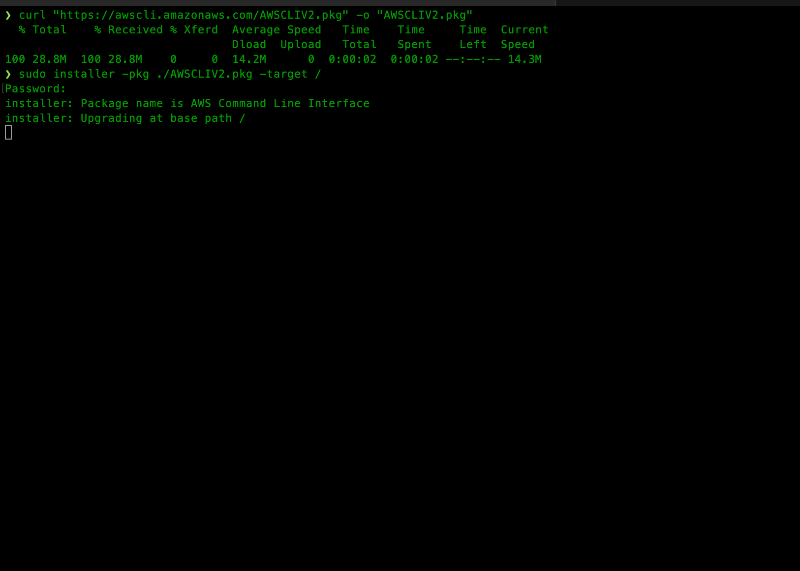
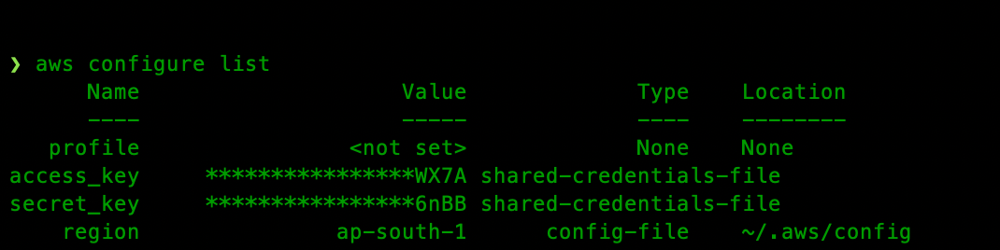

# Week 0 — Billing and Architecture

## Installing AWS CLI/Tasks

I have aws cli installed on my mac machine as I had used some s3 commands previously. I am putting down the steps on how I had installed the same.



Following instructions were used:

```
curl "https://awscli.amazonaws.com/AWSCLIV2.pkg" -o "AWSCLIV2.pkg"
sudo installer -pkg AWSCLIV2.pkg -target / **in my terminal**

which aws
aws --version
```




### Create a Budget


### Alarm Config JSON

```json

```


